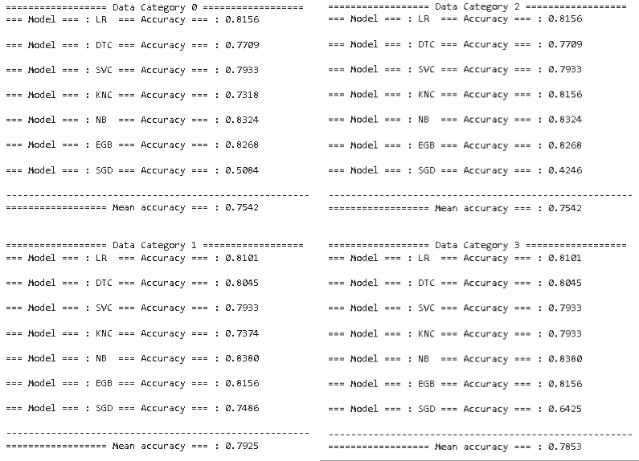

# Titanic_Tutorial
This project uses one of Kaggle's most popular datasets to implement and compare various machine learning algorithms. The goal is to select the algorithm with the highest accuracy and then fine-tune the model.
The project consists of the following sections:
* Load libraries.
* Read the data.
* Explore the data.
* Visualization.
* Data preprocessing.
* Feature engineering.
* Model Selection.
## Problem Description
The main objective in this problem is to predict whether a passenger will survive to the titanic catastrophe based on certain features. The submission file should most be a two column data set, one containing the passenger ID (sorted in any way) and the other column must have 1 or 0, depending on if the passenger dont survived 0 and 1 if the passenger survived.
The features are the following: 
1.
## The approach
This project make use of feature engineering, und because of thath I constructed 4 data category each one with specific alterations to their features. After data preprocessing the categories are the following:
* Category 0: Remain unchanged.
* Category 1: New column created; the sum of sibsp and parch consider as total relatives column, "TRelatives".
* Category 2: Age and Fare columns are normalized.
* Category 3: A combination of category 1 and 2.
After creating the 4 different data categories, these data sets are proccesed by different algorithms:
* LR: Logistic Regression.
* DTC: Desicion Tree Classifier.
* SVC: Suport Vector Classifie.
* KNC: K-neighbohrs Classifier.
* NB: Naive-Bayes.
* EGB: Extreme Gradient Boosting.
* SGD: Stochastic Gradient Descent.
* rf: Random Forest.
* Voting classifier.
## Results
In the image below, accuracies corresponding to each of the machine learning models are shown, divided by data categories. In this first image, I consider splitting the data using the common function "train_test_split()" included in scikit-learn library. As we can see, the accuracies are good, with data category 1 appearing to be the most model-friendly, as it has the highest mean accuracy (with no great difference). However, as an individual model, the best performance was achivied by the Naive-Bayes algorithm in all four data categories. It is important to highlight that in data categories where features were normalized, algorithms like k-neighbohrs classifier improved their accuracy due to their sensitivity to feature scaling.

