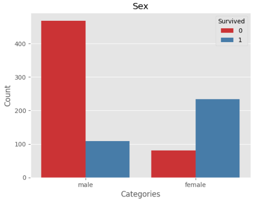
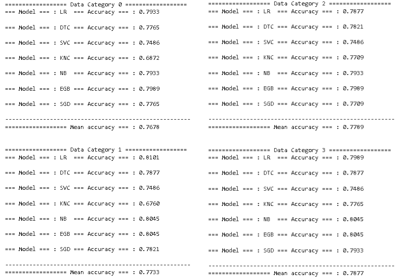

# Titanic_Tutorial
This project uses one of Kaggle's most popular datasets to implement and compare various machine learning algorithms. The goal is to select the algorithm with the highest accuracy and then fine-tune the model.
The project consists of the following sections:
* Load libraries.
* Read the data.
* Explore the data.
* Visualization.
* Data preprocessing.
* Feature engineering.
* Model Selection.
## Problem Description
The main objective in this problem is to predict whether a passenger will survive to the titanic catastrophe based on certain features. The submission file should most be a two column data set, one containing the passenger ID (sorted in any way) and the other column must have 1 or 0, depending on if the passenger dont survived 0 and 1 if the passenger survived.
The features are the following: 
* survival: Target
* pclass: ticket class; 1=1st, 2=2nd and 3=3rd
* sex
* age 
* sibsp: # of siblings/spouses aboard
* parch: # of parents/children
* ticket
* fare
* cabin
* embarked: port of embarkation; C = Cherbourg, Q = Queenstown, S = Southampton

From the features above, I only step aside the columns cabin and ticket this due to the great quantity of missing values in each column. I also don´t consider usefull the columns of name and passengerId. In the next image we can see a histogram of each of the features as a first look of the data. More over, after some data wrangling in the next two images we can see two histograms one to corresponding to the sex and the other to the embarked location in conjuction to the quantiy of people that survived or not.

## The approach
This project make use of feature engineering, und because of thath I constructed 4 data category each one with specific alterations to their features. After data preprocessing the categories are the following:
* Category 0: Remain unchanged (original).
* Category 1: "TRelatives" column created, which is the sum of sibsp and parch columns (total relatives). Sibps and parch columns were deleted.
* Category 2: Age and Fare columns are normalized.
* Category 3: A combination of category 1 and 2.

After creating the 4 different data categories, these data sets are proccesed by different algorithms:
* LR: Logistic Regression.
* DTC: Desicion Tree Classifier.
* SVC: Suport Vector Classifie.
* KNC: K-neighbohrs Classifier.
* NB: Naive-Bayes.
* EGB: Extreme Gradient Boosting.
* SGD: Stochastic Gradient Descent.
* rf: Random Forest.
* Voting classifier.
## Results
In the image below, accuracies corresponding to each of the machine learning models are shown, divided by data categories. In this first image, I consider splitting the data using the common function "train_test_split()" included in scikit-learn library. As we can see, the accuracies are good, with data category 1 appearing to be the most model-friendly, as it has the highest mean accuracy (with no great difference). However, as an individual model, the best performance was achivied by the Naive-Bayes algorithm in all four data categories. It is important to highlight that in data categories where features were normalized, algorithms like k-neighbohrs classifier improved their accuracy due to their sensitivity to feature scaling.

Now considering a stratified sampling using "StratifiedShuffleSplit()" function. The results of the accuracies appear to reduced. This method was considered due to the task of classfication, that means it is important to have representative data in both train and test sets. With this method, the best performance was obtained by the logistic regression algorithm in conjuction of the data category 1. 

